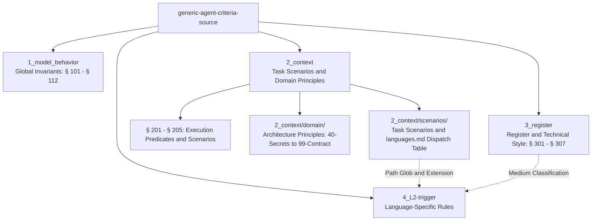
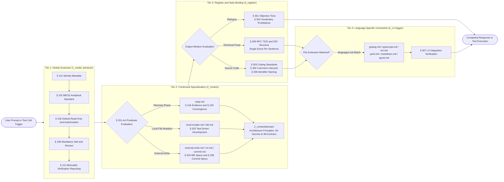
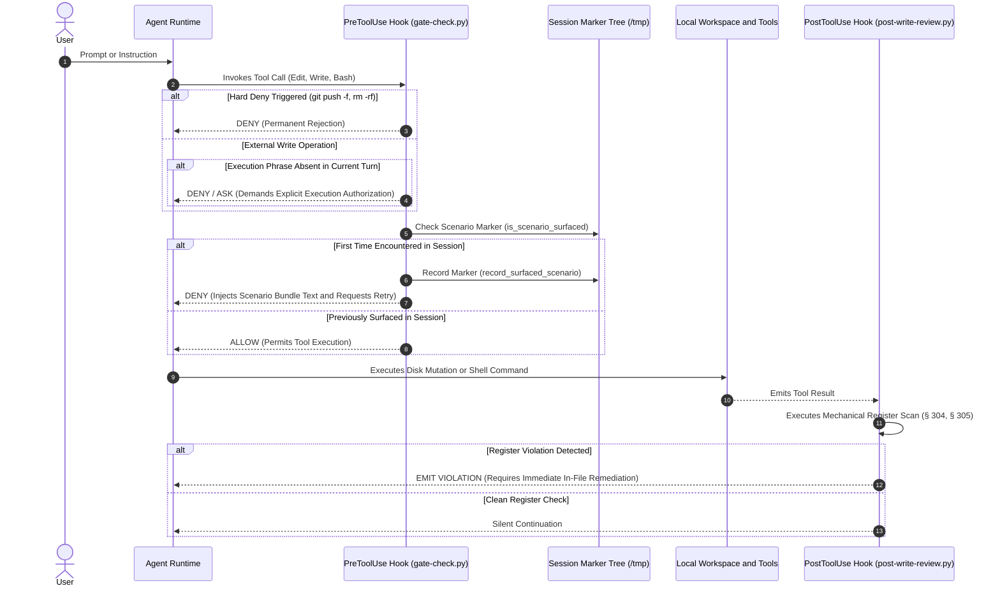
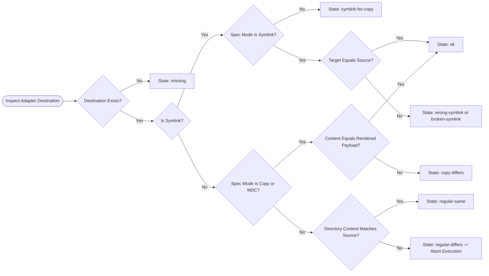

# Generic Agent Criteria Source

This repository serves as the Single Source of Truth for agent behavior rules, contextual scenarios, engineering register standards, and technology domain principles. The repository materializes these specifications into runtime environments across multiple agent hosts, including Claude Code, Cursor, Gemini, and Grok.



## Section 0. Operational Commands and Verification

### Item A. Adapter Status Inspection and Materialization

The installer operates in read-only inspection mode by default. Materializing files requires the explicit `apply` verb:

1. **Inspect adapter status without modifying state**

    ```bash
    uv run python hooks/bin/install-adapters.py check
    ```

2. **Materialize and reconcile allow-listed adapter files**

    ```bash
    uv run python hooks/bin/install-adapters.py apply
    ```

### Item B. Test Execution

The test suite validates adapter synchronization, scenario parsing, hook gate decisions, and register scanning. Execute unit and integration tests by:

```bash
.venv/bin/pytest -v
```

### Item C. Static Analysis and Linting

Code modifications across Python modules and test files must comply with project formatting and import order constraints. Verify Python source compliance by:

```bash
ruff check .
```

## Section 1. Four-Axis Criteria Architecture

The criteria system decouples requirements across four mutually exclusive and collectively exhaustive directories. Global mandates remain active across all operational phases. Task scenarios, register constraints, and language rules activate conditionally upon matching operational context.

1. `1_model_behavior/`: Global behavioral invariants (§ 101 through § 112). These clauses govern identity disambiguation, MECE analytical standards, default read-only boundaries, priority queues, immediate halt controls, and minimalist verification reporting. Every agent execution MUST adhere to these rules by default.
2. `2_context/`: Contextual task scenarios and engineering domain principles (§ 201 through § 205, `scenarios/`, and `domain/`). These clauses define operational predicates, Test-Driven Development lifecycles, Merge Request authoring, Conventional Commit generation, and technology domain guidelines.
3. `3_register/`: Professional register and syntax specifications (§ 301 through § 307). These clauses define impersonal tone, vocabulary prohibitions, general coding standards, code comment limits, and RFC 7322 / ISO/IEC Directives Part 2 prose structures.
4. `4_L2-trigger/`: Programming language-specific constraints (`golang.md`, `typescript.md`, `hcl.md`, `yaml.md`, `markdown.md`, and `ipynb.md`). A file in this directory activates only when a targeted file extension matches the dispatch patterns defined in `2_context/scenarios/languages.md`.

## Section 2. Criteria Evaluation Pipeline

### Item A. Evaluation Pipeline Topology

When an operational request or tool call enters the runtime, the evaluation pipeline enforces rules through four sequential tiers:



### Item B. Tier Breakdown

1. **Global Invariants (Tier 1)**: Initial evaluation subjects every prompt and action to the behavioral mandates in `1_model_behavior/`. § 101 controls identity boundaries. § 102 enforces structured problem decomposition. § 106 enforces read-only operation until explicit authorization occurs. § 108 intercepts halt directives. § 111 limits execution responses to verification evidence.
2. **Contextual Specialization (Tier 2)**: § 201 evaluates the operational act:
    - A planning or inquiry interaction routes to `reply.md`, binding § 104 due diligence and § 109 single recommendation convergence.
    - A working-tree byte modification routes to `local-mutate.md`, binding § 202 Test-Driven Development whenever test paths match.
    - A command modifying remote state (`git push`, `glab`, `gh`, or MCP write) routes to `external-write.md`, binding § 204 for Merge Requests or § 205 for Conventional Commits.
    - Technology-specific system changes incorporate matching domain principles from `2_context/domain/`.
3. **Register Binding (Tier 3)**: Output generation attaches structural constraints based on medium:
    - Dialogue must satisfy § 301 impersonal tone and § 302 vocabulary limits.
    - Documentation and commit text must satisfy § 305 sentence independence rules.
    - Source code must satisfy § 303 standards, § 304 comment line limits, and § 306 function naming conventions.
4. **Language Constraints (Tier 4)**: File paths matching patterns in `2_context/scenarios/languages.md` attach corresponding rules from `4_L2-trigger/`. § 307 completes the validation loop.

### Item C. Runtime Hook Execution Lifecycle

Claude Code and Cursor environments enforce criteria compliance via PreToolUse, PostToolUse, and Stop hooks.



### Item D. Hook Operation Contracts

1. **PreToolUse (`hooks/adapters/claude/gate-check.py`)**: Intercepts `Edit`, `Write`, `StrReplace`, `TabWrite`, and `Bash` operations. Blocks destructive commands immediately. Demands an authorization phrase for external write operations. When an operational scenario triggers for the first time in a session, the hook records a state marker, rejects the call, and surfaces the scenario bundle text for immediate retry. Subsequent calls with that scenario ID pass through without interruption.
2. **PostToolUse (`hooks/adapters/claude/post-write-review.py`)**: Reviews file modifications landing on disk. Scans modified lines for register violations, including bare pronoun references, uncoordinated causal conjunctions, and excessive comment lengths. Detected violations require immediate correction before subsequent tool execution.
3. **Shared Parser Module (`hooks/adapters/claude/scenario_parser.py`)**: Centralizes YAML frontmatter extraction, scenario directory traversal, and path glob specificity calculations.

## Section 3. Harness Adapter Installation and Reconciliation

### Item A. Installation-Evaluation State Machine

The adapter installer (`hooks/adapter_install/install.py`) materializes repository sources into runtime target paths under product homes (`~/.agents`, `~/.claude`, `~/.cursor`, `~/.grok`, `~/.gemini`). The installer relies exclusively on Python standard library modules without invoking external shell commands or subprocesses.



### Item B. Allow-Listed Adapter Destinations

| Source Path                                       | Destination Path                       | Mode       |
| ------------------------------------------------- | -------------------------------------- | ---------- |
| `rules/AGENT_CRITERIA.md`                         | `~/.agents/AGENTS.md`                  | symlink    |
| `rules/AGENT_CRITERIA.md`                         | `~/.gemini/GEMINI.md`                  | symlink    |
| `hooks/adapters/claude/CLAUDE.md`                 | `~/.claude/CLAUDE.md`                  | copy       |
| `hooks/adapters/claude/gate-check.py`             | `~/.claude/hooks/gate-check.py`        | copy       |
| `hooks/adapters/claude/post-write-review.py`      | `~/.claude/hooks/post-write-review.py` | copy       |
| `hooks/adapters/claude/scenario_parser.py`        | `~/.claude/hooks/scenario_parser.py`   | copy       |
| `hooks/adapters/claude/gate-check.py`             | `~/.cursor/hooks/gate-check.py`        | copy       |
| `hooks/adapters/claude/post-write-review.py`      | `~/.cursor/hooks/post-write-review.py` | copy       |
| `hooks/adapters/claude/scenario_parser.py`        | `~/.cursor/hooks/scenario_parser.py`   | copy       |
| `hooks/adapters/cursor/stop-output-scan.py`       | `~/.cursor/hooks/stop-output-scan.py`  | copy       |
| `hooks/adapters/cursor/skill-module-gate.py`      | `~/.cursor/hooks/skill-module-gate.py` | copy       |
| `hooks/adapters/cursor/hooks.json`                | `~/.cursor/hooks.json`                 | copy       |
| `hooks/adapters/skills`                           | `~/.agents/skills`                     | symlink    |
| `hooks/criteria`                                  | `~/.agents/criteria`                   | symlink    |
| `rules/ENGINEERING_PRINCIPLES.md`                 | `~/.agents/ENGINEERING_PRINCIPLES.md`  | symlink    |
| `hooks/criteria/4_L2-trigger/markdown.md`         | `~/.claude/lang_md.md`                 | symlink    |
| `hooks/criteria/4_L2-trigger/hcl.md`              | `~/.claude/lang_hcl.md`                | symlink    |
| `hooks/criteria/4_L2-trigger/typescript.md`       | `~/.claude/lang_ts.md`                 | symlink    |
| `hooks/criteria/4_L2-trigger/ipynb.md`            | `~/.claude/lang_ipynb.md`              | symlink    |
| `hooks/criteria/4_L2-trigger/yaml.md`             | `~/.claude/lang_yaml.md`               | symlink    |
| `hooks/criteria/4_L2-trigger/golang.md`           | `~/.claude/lang_go.md`                 | symlink    |
| `hooks/criteria/4_L2-trigger/markdown.md`         | `~/.gemini/lang_md.md`                 | symlink    |
| `hooks/criteria/4_L2-trigger/hcl.md`              | `~/.gemini/lang_hcl.md`                | symlink    |
| `hooks/criteria/4_L2-trigger/typescript.md`       | `~/.gemini/lang_ts.md`                 | symlink    |
| `hooks/criteria/4_L2-trigger/ipynb.md`            | `~/.gemini/lang_ipynb.md`              | symlink    |
| `hooks/criteria/4_L2-trigger/yaml.md`             | `~/.gemini/lang_yaml.md`               | symlink    |
| `hooks/criteria/4_L2-trigger/golang.md`           | `~/.gemini/lang_go.md`                 | symlink    |
| `rules`                                           | `~/.grok/rules`                        | symlink    |
| `skills`                                          | `~/.grok/skills`                       | symlink    |
| `config/contexts.toml`                            | `~/.grok/contexts.toml`                | symlink    |
| `config/contexts.toml`                            | `~/.claude/contexts.toml`              | symlink    |
| `config/contexts.toml`                            | `~/.gemini/contexts.toml`              | symlink    |
| `hooks/criteria/2_context/scenarios/languages.md` | `~/.cursor/rules/lang-<id>.mdc`        | cursor-mdc |

Cursor `.mdc` files render dynamically from each record declared in `languages.md`. File copies utilize atomic replacement via temporary files to eliminate incomplete read windows.
